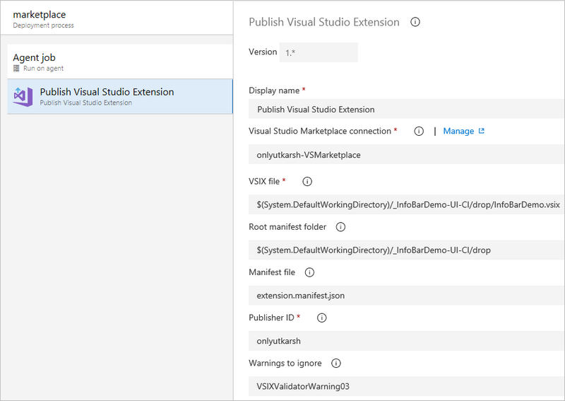

## Publish Visual Studio Extension task

With this task you will be able to publish a Visual Studio extension to Marketplace.

This task uses [VSIXPublisher](https://docs.microsoft.com/en-us/visualstudio/extensibility/walkthrough-publishing-a-visual-studio-extension-via-command-line?view=vs-2017) program to publish Visual Studio extension to Marketplace.

> VSIXPublisher executable is not shipped with this task, hence this task needs to be run on an agent where at least Visual Studio 2017 with `Microsoft.VisualStudio.Component.VSSDK` workload installed. `Hosted VS 2017` pool contains agents with both Visual Studio and Microsoft.VisualStudio.Component.VSSDK installed.

### Screenshot

