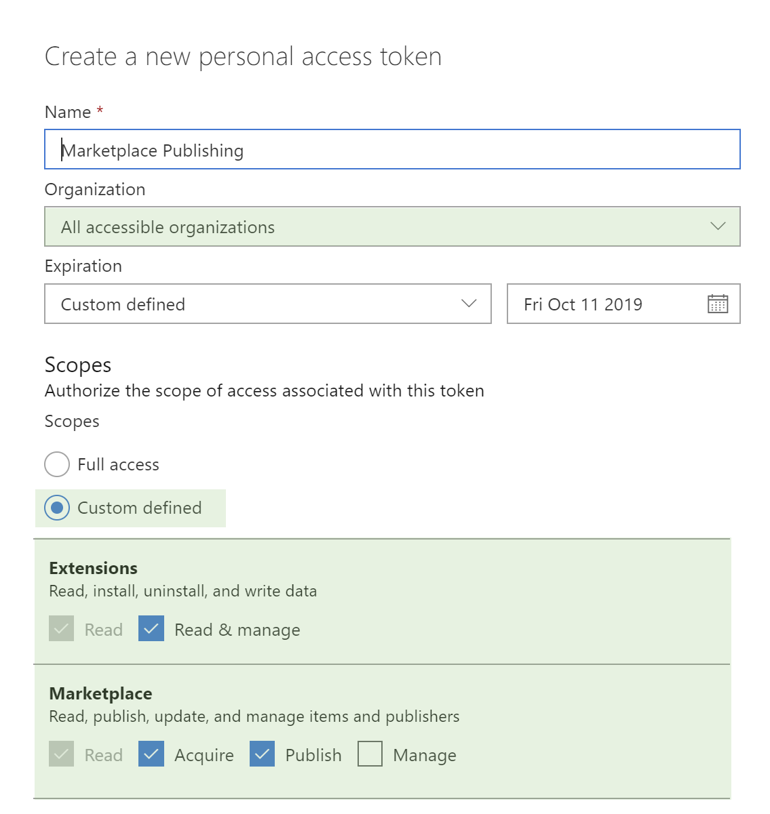

# Azure DevOps Extension Tasks

This extension provides Azure Pipelines tasks to package, publish, and manage Azure DevOps extensions in the [Visual Studio Marketplace](https://marketplace.visualstudio.com).

## To use

[Learn more](https://marketplace.visualstudio.com/items?itemName=ms-devlabs.vsts-developer-tools-build-tasks) about this extension and install the extension into your Azure DevOps Organization via the Visual Studio Marketplace.

## Available commands

- **Package**: Package an Azure DevOps extension into a `.vsix` file.
- **Publish**: Optionally package and publish an extension to the Visual Studio Marketplace.
- **Unpublish**: Remove an extension from the Visual Studio Marketplace.
- **Share**: Share an extension with an Azure DevOps organization.
- **Unshare**: Remove sharing for an extension from one or more Azure DevOps organizations.
- **Install**: Install an extension into an Azure DevOps organization.
- **Show**: Query extension metadata from the marketplace.
- **Query version**: Query the current extension version and optionally increment it.
- **Wait for validation**: Wait for Marketplace validation to finish.
- **Wait for installation**: Wait until extension tasks are available in target organizations.

### Required scopes

When creating a PAT for pipeline automation, include at least the following scopes:

- **Publish**: `Marketplace (publish)`
- **Unpublish**: `Marketplace (manage)`
- **Share**: `Marketplace (publish)`
- **Unshare**: `Marketplace (publish)`
- **Install**: `Extensions (read and manage)`, `Marketplace (acquire)`
- **Show**: `Marketplace (read)`
- **Query version**: `Marketplace (read)`
- **Wait for validation**: `Marketplace (read)`
- **Wait for installation**: `Extensions (read and manage)`, `Agent Pools (read)`

## Documentation

- [v6 docs index](./docs/README.md)
- [Using v6 in Azure Pipelines](./docs/azure-pipelines.md)
- [Using v6 in GitHub Actions](./docs/github-actions.md)
- [Authentication and OIDC](./docs/authentication-and-oidc.md)
- [Design and architecture](./docs/design-and-architecture.md)
- [Contributing guide](./docs/contributing.md)
- [Migrate Azure Pipelines from v5 to v6](./docs/migrate-azure-pipelines-v5-to-v6.md)
- [Migrate Azure Pipelines to GitHub Actions](./docs/migrate-azure-pipelines-v6-to-github-actions.md)
- [Migrate Azure Pipelines v5 to GitHub Actions](./docs/migrate-azure-pipelines-v5-to-github-actions.md)

## Contribute

1. From the root of the repo run `npm run initdev`. This will pull down the necessary modules and TypeScript declare files.
2. Run `npm run build` to compile the build tasks.
3. Run `npm run package` to create a .vsix extension package that includes the build tasks.
