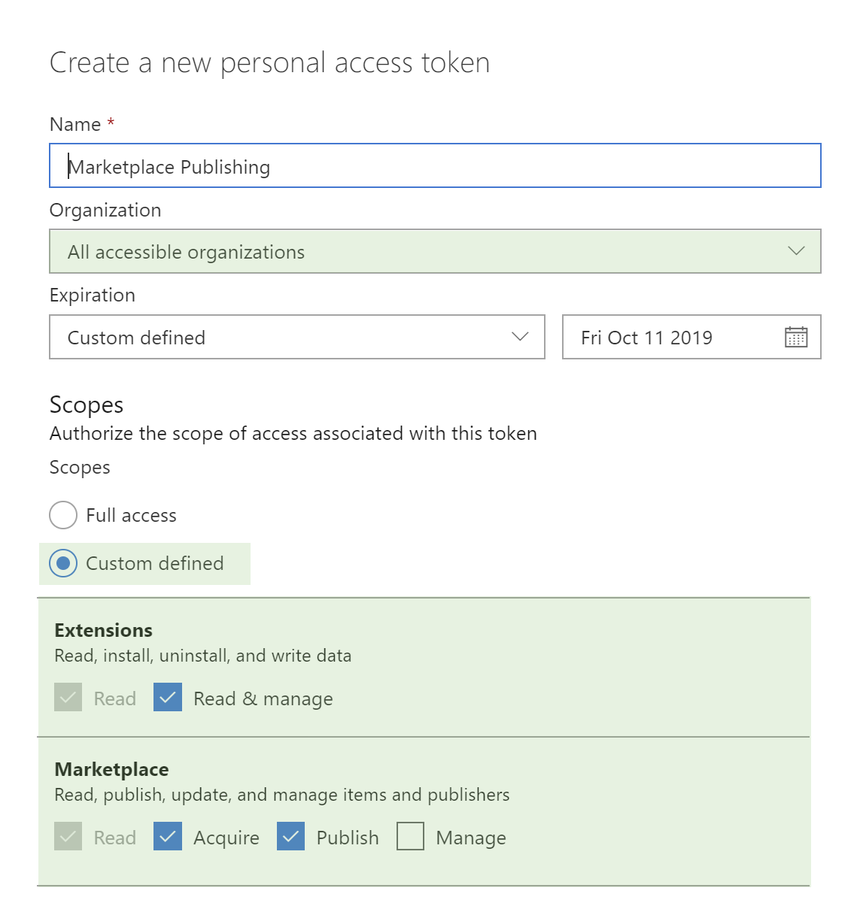

# Azdo Marketplace Action & Tasks

This repository hosts GitHub Actions and Azure Pipelines tasks to package, publish, and manage Azure DevOps extensions in the [Visual Studio Marketplace](https://marketplace.visualstudio.com).

## Available commands

- **Package**: Package an Azure DevOps extension into a `.vsix` file.
- **Publish**: Optionally package and publish an extension to the Visual Studio Marketplace.
- **Unpublish**: Remove an extension from the Visual Studio Marketplace.
- **Share**: Share an extension with an Azure DevOps organization.
- **Unshare**: Remove sharing for an extension from one or more Azure DevOps organizations.
- **Install**: Install an extension into an Azure DevOps organization.
- **Show**: Query extension metadata from the marketplace.
- **Query version**: Query the current extension version and optionally increment it.
- **Wait for validation**: Wait for Marketplace validation to finish.
- **Wait for installation**: Wait until extension tasks are available in target organizations.

## Documentation

- [v6 docs index](./docs/README.md)
- [Using v6 in Azure Pipelines](./docs/azure-pipelines.md)
- [Using v6 in GitHub Actions](./docs/github-actions.md)
- [Authentication and OIDC](./docs/authentication-and-oidc.md)
- [Design and architecture](./docs/design-and-architecture.md)
- [Contributing guide](./docs/contributing.md)
- [Migrate Azure Pipelines from v5 to v6](./docs/migrate-azure-pipelines-v5-to-v6.md)
- [Migrate Azure Pipelines to GitHub Actions](./docs/migrate-azure-pipelines-v6-to-github-actions.md)
- [Migrate Azure Pipelines v5 to GitHub Actions](./docs/migrate-azure-pipelines-v5-to-github-actions.md)

### Required scopes

When creating a PAT for pipeline automation, include at least the following scopes:

- **Publish**: `Marketplace (publish)`
- **Unpublish**: `Marketplace (manage)`
- **Share**: `Marketplace (publish)`
- **Unshare**: `Marketplace (publish)`
- **Install**: `Extensions (read and manage)`, `Marketplace (acquire)`
- **Show**: `Marketplace (read)`
- **Query version**: `Marketplace (read)`
- **Wait for validation**: `Marketplace (read)`
- **Wait for installation**: `Extensions (read and manage)`, `Agent Pools (read)`



## GitHub Marketplace sample (main action)

```yaml
- uses: jessehouwing/azdo-marketplace@v6
  id: publish
  with:
    operation: publish
    auth-type: pat
    token: ${{ secrets.MARKETPLACE_TOKEN }}
    publisher-id: my-publisher
    extension-id: my-extension
    manifest-file: vss-extension.json

- run: echo "VSIX: ${{ steps.publish.outputs.vsix-file }}"
```

### Main action inputs

**General**

- `operation`: Selects which command to run (`package`, `publish`, `install`, `share`, `unshare`, `unpublish`, `show`, `query-version`, `wait-for-validation`, `wait-for-installation`).

**Connection & Authentication**

- `auth-type`: Chooses authentication mode (`pat`, `basic`, `oidc`) for authenticated operations.
- `service-url`: Overrides the Azure DevOps/Marketplace endpoint for supported operations.
- `token`: Provides the secret token used for `pat` and `basic` authentication.
- `tfx-version`: Selects the `tfx-cli` source (`built-in`, `path`, or npm version spec); `built-in` uses the bundled vesion, while `path` uses `tfx` from PATH.
- `username`: Provides the username when `auth-type` is `basic`.

**Extension identity**

- `extension-id`: Sets or overrides the extension identifier inside the publisher namespace (required for `show`, optional for `install`/`share`/`unshare`/`unpublish`/`wait-for-validation`/`query-version` when inferred from manifest or VSIX inputs).
- `publisher-id`: Sets or overrides the extension publisher identifier (required for `show`, optional for `install`/`share`/`unshare`/`unpublish`/`wait-for-validation`/`query-version` when inferred from manifest or VSIX inputs).

**Input sources**

- `manifest-file`: Points to one or more manifest files used for manifest-based operations and identity fallback in install/share/unshare/unpublish/wait-for-validation/query-version.
- `manifest-file-js`: Points to a JS manifest module for `tfx --manifest-js`.
- `overrides-file`: Points to an overrides JSON file merged into manifest packaging/publishing.
- `use`: Chooses publish input source (`manifest` or `vsix`).
- `vsix-file`: Points to a pre-built VSIX file when publishing from VSIX source.
- `vsix-file`: Provides a VSIX file for identity/task discovery in install/share/unshare/validation flows.

**Packaging options**

- `bypass-validation`: Skips package-time validation checks.
- `extension-name`: Overrides extension display name during package/publish.
- `extension-pricing`: Overrides pricing behavior (`default`, `free`, `paid`).
- `extension-version`: Overrides extension version during package/publish/validation flows.
- `extension-visibility`: Overrides marketplace visibility (`private`, `public`, preview variants).
- `localization-root`: Points to localization resources for package/publish.
- `no-wait-validation`: Skips waiting for marketplace validation after publish.
- `output-path`: Sets where generated VSIX files are written.
- `update-tasks-id`: Regenerates deterministic task IDs for extension variants.
- `update-tasks-version`: Controls task version update strategy (`none`, `major`, `minor`, `patch`).

**Organization targeting**

- `accounts`: Provides newline-separated Azure DevOps organizations for install/share/unshare/verification operations.

**Query version**

- `marketplace-version-action`: Controls how the queried marketplace version is transformed (`None`, `Major`, `Minor`, `Patch`).
- `version-source`: Specifies which version sources to consider (newline-separated); highest valid semver wins. Values: `marketplace`, `manifest`, `vsix`, or a semver literal. Defaults to `marketplace`.

**Wait for validation / installation**

- `polling-interval-seconds`: Sets polling interval between checks.
- `timeout-minutes`: Sets total wait time.

**Wait for installation**

- `expected-tasks`: Provides task/version expectations to verify.

### Main action outputs

**Package / publish**

- `vsix-file`: Returns path to the generated VSIX file.

**Show**

- `metadata`: Returns extension metadata JSON.

**Query version**

- `current-version`: Returns the current version before any increment is applied.
- `proposed-version`: Returns the computed version after applying the version action.
- `version-source`: Returns the source that provided the winning version (`marketplace`, `manifest`, `vsix`, or `literal`).

## GitHub Marketplace samples (individual composite actions)

### package

```yaml
- uses: jessehouwing/azdo-marketplace/package@v6
  id: package
  with:
    publisher-id: my-publisher
    extension-id: my-extension
    manifest-file: vss-extension.json

- run: echo "Packaged: ${{ steps.package.outputs.vsix-file }}"
```

### publish

```yaml
- uses: jessehouwing/azdo-marketplace/publish@v6
  with:
    token: ${{ secrets.MARKETPLACE_TOKEN }}
    publisher-id: my-publisher
    extension-id: my-extension
    manifest-file: vss-extension.json
```

### install

```yaml
- uses: jessehouwing/azdo-marketplace/install@v6
  with:
    token: ${{ secrets.MARKETPLACE_TOKEN }}
    manifest-file: vss-extension.json
    accounts: myorg
```

### share

```yaml
- uses: jessehouwing/azdo-marketplace/share@v6
  with:
    token: ${{ secrets.MARKETPLACE_TOKEN }}
    manifest-file: vss-extension.json
    accounts: customer-org
```

### unshare

```yaml
- uses: jessehouwing/azdo-marketplace/unshare@v6
  with:
    token: ${{ secrets.MARKETPLACE_TOKEN }}
    manifest-file: vss-extension.json
    accounts: old-customer-org
```

### unpublish

```yaml
- uses: jessehouwing/azdo-marketplace/unpublish@v6
  with:
    token: ${{ secrets.MARKETPLACE_TOKEN }}
    manifest-file: vss-extension.json
```

### show

```yaml
- uses: jessehouwing/azdo-marketplace/show@v6
  id: show
  with:
    token: ${{ secrets.MARKETPLACE_TOKEN }}
    publisher-id: my-publisher
    extension-id: my-extension

- run: echo '${{ steps.show.outputs.metadata }}'
```

### query-version

```yaml
- uses: jessehouwing/azdo-marketplace/query-version@v6
  id: query
  with:
    token: ${{ secrets.MARKETPLACE_TOKEN }}
    publisher-id: my-publisher
    extension-id: my-extension
    marketplace-version-action: Patch

- run: echo "Next: ${{ steps.query.outputs.proposed-version }}"
```

### wait-for-validation

```yaml
- uses: jessehouwing/azdo-marketplace/wait-for-validation@v6
  with:
    token: ${{ secrets.MARKETPLACE_TOKEN }}
    manifest-file: vss-extension.json
```

### wait-for-installation

```yaml
- uses: jessehouwing/azdo-marketplace/wait-for-installation@v6
  with:
    token: ${{ secrets.MARKETPLACE_TOKEN }}
    publisher-id: my-publisher
    extension-id: my-extension
    accounts: myorg
    manifest-file: vss-extension.json
```

## Contribute

1. From the root of the repo run `npm run initdev`. This will pull down the necessary modules and TypeScript declare files.
2. Run `npm run build` to compile the build tasks.
3. Run `npm run package` to create a .vsix extension package that includes the build tasks.
