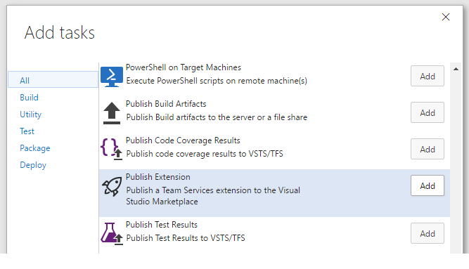

# Build and Release Tasks for Team Services Extensions

Tasks to help you simplify and automate the delivery of Team Services extensions. Package, publish, share, and install your Team Services extensions to the Visual Studio Marketplace.

## Tasks included

* **Package**: package a Team Services extension into an extension package (.VSIX) file
* **Publish**: publish an extension (either privately or publicly) to the Visual Studio Marketplace
* **Share**: share an extension with a Team Services account
* **Install**: install an extension to a Team Services account
* **Query version**: query an extension's version (to make it easy to increment on your next package or publish)

## Steps

After installing the extension, you can add one (or more) of the tasks to a new or existing [build definition](https://www.visualstudio.com/en-us/docs/build/define/create) or [release definition](https://www.visualstudio.com/en-us/docs/release/author-release-definition/more-release-definition)

If you plan to publish to the Marketplace, you will need to [create a personal access token](https://www.visualstudio.com/docs/setup-admin/team-services/use-personal-access-tokens-to-authenticate). 
 
### Required permissions
 
 * **Publish**: All Accounts, Marketplace Publish
 * **Share**: All Accounts, Marketplace Publish
 * **Install**: All Accounts or a Specific Account, Extensions (read and manage), Marketplace
 * **Query Version**: All Accounts, Marketplace
 
## Learn more

The [source](https://github.com/Microsoft/vsts-extension-build-release-tasks) for this extension is on GitHub. Take, fork, and extend.

## Contributors

This extension was created by Microsoft with help from the community. We'd like to thank Wouter de Kort and Jesse Houwing for their contributions.

## Feedback & Issues

If you have feedback or issues, please [send an email](mailto:vsointegration@microsoft.com) or file an issue on [GitHub](https://github.com/Microsoft/vsts-extension-build-release-tasks/issues)